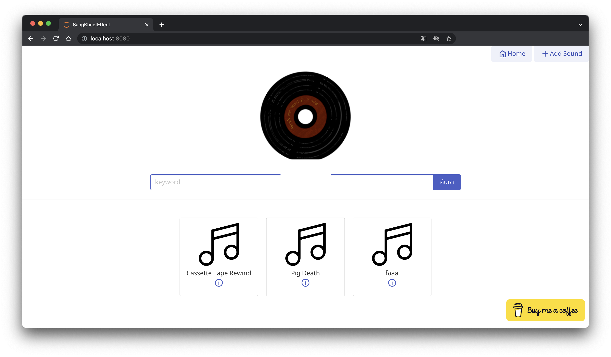

# Sangkeeteffect B Version


## Qick Start
1 ติดตั้ง requirements โดยใช้คำสั้ง
```bash
$pip install -r requirements.txt
```
2 Runตัว`main_app.py`เพื่อเริ่มการทำงานโดยใช้คำสั้ง
```
$python3 {path ของ main_app.py}
```


